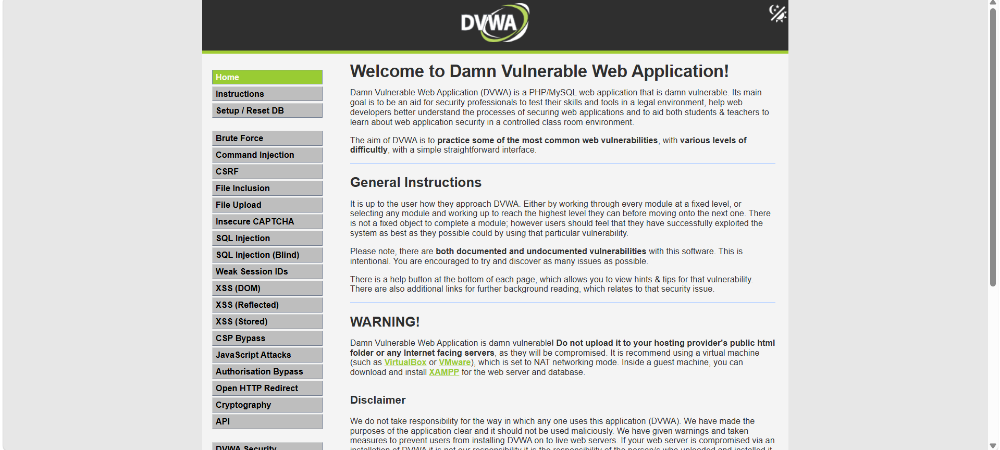

# SQL Injection Learning

## 漏洞简介

SQL Injection（SQL注入）是一种由于后台直接拼接SQL语句导致的安全漏洞。

攻击者可以通过构造特殊输入影响数据库查询逻辑。

---

## DVWA环境

- 靶场：DVWA
- 安全等级：Low
- 环境：PHP + MySQL

---

## 漏洞原理

后台代码类似：

```php
$sql = "SELECT * FROM users WHERE id='$id'";
```

用户输入会直接进入SQL语句。

如果没有过滤，就可能导致SQL逻辑被修改。

---

## 实验过程

### 正常输入

输入：

```sql
1
```

页面正常返回用户信息。

---


### 异常输入

输入特殊字符后：

```sql
'
```

页面出现SQL报错。

说明后台可能存在SQL注入漏洞。

---

## 漏洞危害

- 数据泄露
- 登录绕过
- 数据库信息暴露

---

## 修复方案

### 参数化查询

使用 Prepared Statement。

---

### 输入校验

限制输入类型。

---

### 最小权限原则

数据库账户不要使用高权限。

---

## 学习总结

通过本实验，我理解了SQL注入的形成原因以及基本防御思路。