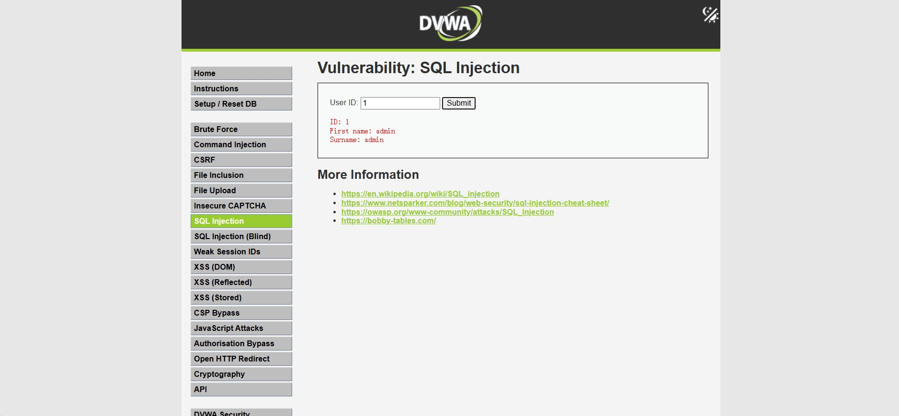
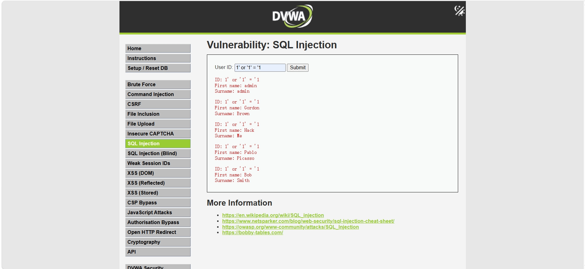

# SQL Injection Learning

## 漏洞简介

SQL Injection（SQL注入）是一种由于后台直接拼接SQL语句导致的安全漏洞。

攻击者可以通过构造特殊输入影响数据库查询逻辑。

---

## DVWA环境

- 靶场：DVWA
- 安全等级：Low
- 环境：PHP + MySQL
- 注：这个靶场的安全等级一定要是lwo，要不然攻击会失败

---


## 漏洞原理

后台代码类似：

```php
$sql = "SELECT * FROM users WHERE id='$id'";
```

用户输入会直接进入SQL语句。

如果没有过滤，就可能导致SQL逻辑被修改。

---

## 实验过程

### 正常输入

输入：

```sql
1
```
后台代码类似
```php
$sql = "SELECT * FROM users WHERE id='1'";
```

页面正常返回用户信息。
相当于查询user_id为1的用户信息

---


### 异常输入

输入字符串后：

```sql
1' or '1' = '1
```
后台代码类似:
```php
$sql = "SELECT * FROM users WHERE id='1' or '1' = '1'";
```

运用了逻辑或OR语句，只要有一个条件为真，整个表达式就为真。所以这条语句会返回users表中的所有记录；


这就是sql注入

---


## 漏洞危害
- 通过上述注入的例子我们可以了解到，如果攻击者输入恶意sql语句，在你电脑安全等级低的情况下，
会导致用户信息严重泄漏。攻击者会获取所有的用户的账号和密码等敏感信息，
也可以在登陆界面进行sql注入从而绕过登录直接访问你的电脑，甚至可以通过这种方式修改或删除电脑数据库中的数据。


---

## 修复方案

### 参数化查询

使用 Prepared Statement。
即预编译语句：先把 SQL 语句的固定结构发给数据库编译好，再把用户输入的内容作为纯数据参数传递进去，
这时候攻击者如果在输入1' or '1' = '1的语句也会被系统当作一条普通字符串而不是代码执行。

---

### 输入校验

限制输入类型。

---

### 最小权限原则

数据库账户不要使用高权限。

---

## 学习总结

通过本实验，我了解了sql注入的基本方式与基本原理，后续的进阶操作还需通过个人的不断学习来完善。